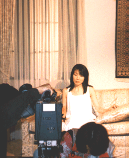

  
周りは風邪をひいている人でいっぱいですが、あなたはお元気ですか。  
私は普段、とっても丈夫です。でも、イク時は一気にイクので、周りの人からは「こわい存在」かもと思います。  肺炎で突然入院した時は、風邪かと思って、１週間、３９℃～４０℃の熱のまま、家で「ルル」を飲んで寝ていたんだった。  
でも、ちょっとセキが変だし、声も全くでなくなって、「ルル」も効かないなあと思い、ある朝、近くの大学病院へ行ってレントゲンを撮ったら、その場で即、「今から入院できますか？」と言われ、それから１２日間、家へ帰れませんでした。  
そうそう、不謹慎ですが、その時のレントゲン写真がとってもキレイで、私はちょっと人に見せたかったです。たばこのけむりを、うすくふわーっと吹きかけたみたいに白いもやがかかってた。  
もう１回は、「岡崎、ついに救急車に乗る」だった。  
朝、目を覚ますと、めまいと気分の悪いのとで身動きできず。その日は、ラジオ番組のゲストに行く予定だったので、夕方まで我慢してみたけれど、さすがに「これはだめだ」と思い、電話して来てもらって、そのまま入院でした。あ、そういえば、１１９番に電話したことがありますか？　私は２回。  
ずっと前に、ある避難訓練で、私は１１９番する役になり、しました。  
「はい。火事ですか？ 救急車ですか？」と、あまりに冷静な声で聞かれるので、かけた側は、かえって動揺してしまう、と思う。  
さて、最近は、私にとって重大なある事を、続けるかやめるか考え悩んでいました。私の心は１度死んで、どうしようかと考える、もうその事自体も面倒くさくなっていたのですけれど、優しい人の電話が、そのたったひとことで、私をすくいあげてくれました。  
時々、こんなふうに、自分にとっての「神様の声」に出逢う時がある。やっぱり「思いやり」は、思うだけでなく言葉にすると、それはそれは暖かな力になる時があるなあ、私もそうしていきたいな、と心から思いました。  
－－－－－今は泣いていてもいいの　大丈夫よ　間に合うから 世界中でひとりぼっち　それもきっと大切な時間－－－－－ あいかわらず、あっちの端←→こっちの端と、揺り返しの中にいる私ですが、今年もよろしく。  
１月○日（月）しばらく休んでいたお稽古ごとの教室へ行く。ついでに赤坂の日枝神社にも寄った。おみくじは小吉。「春の日が暖かにやわらぎ、花咲き匂うごとく、今までの悪い運も開けて栄える」そうだ。  
気をよくし、アンナミラースで甘い甘いフルーツクリームパイを食べて帰る。  
１月○日（水）ファンクラブのスタッフの人と会う。お正月にものすごく意欲的で創造的なある企画を思いついて、ひとりで盛り上がって、早く誰かに言いたかった。さっそく相談してみたら、「え！　そ、それは大変すばらしい企画ですが、ちょっとむずかしいかも、、、。」と言われてしまった。 だめかなあ。みなさまも絶対、喜んで下さると思うのに。 でも、私は実現に向けて頑張ることにする。  
我周围很多人最近都得了感冒，你的身体还好吗？ 我平时身体特别的好。但一旦生起病来准是一场大病，所以周围的人都觉得我大概是个十足的怪人。 得肺炎住院的那次，一开始自己认为只是普通的感冒，虽然３９℃～40℃的高烧整整烧了一个星期，自己也只是在家里吃点感冒药、睡睡觉而已。 但之后感觉咳嗽有点怪，声音也发不出来了，心想难道是感冒药过期了？所以一天早上跑到附近的大学医院去拍了张X光片，医生当场就对我说：“你现在能住院吗？”之后的12天，便连家都没有回过。 呵呵，说句玩笑话，那时拍的X光片真的是漂亮极了，一直都想向别人展示以下。仿佛有种用力吸口雪茄，再慢慢吐出的烟雾缭绕感。―_―|| 还有一次，“冈崎我终于坐上救护车了。” 早上醒过来的时候，头晕目眩，全身无法动弹。那天原本的行程是到电视台作节目嘉宾，所以心想还是忍到晚上再说吧，可到底还是撑不住了，赶紧打电话叫救护车，随即就被送到医院去了。啊，说起来，大家以前叫过救护车吗？我一共打过2回。 很久以前，一次避难演习的时候，我分配到的任务是打119求救，那时打过一次。 “你好。请问是火灾还是急救？”（译者注：在日本，119同时兼火警和急救）因为电话那头的声音太冷静了，所以打电话的我反而变得惊慌失措起来。 说起来，最近我身上发生了一些重要的事情，一直在烦恼着，想是该继续做下去呢还就此放弃呢。曾经心灰意冷过一次，因为想事情本身就已经麻烦透顶了，但当接到某人一通温柔的电话，哪怕只是只言片语的安慰，却让我又重拾起了干劲。 我时常会像这样，听到来自神的声音。其实仔细想想，“关怀”这种东西的确不能只藏匿于心中，必须要清楚地表达出来，这样才能给予对方以温暖，而这也正是我所不断想去实现的东西。 －－－－－现在即使哭泣也没关系 放心吧 一切还能挽回 即使整个世界只剩我一人 对我而言 那也是万分珍贵的时间－－－－－ 面前这个一如既往，在真实与虚幻间徘徊不定的我，今年也请大家多多指教啊。 1月某日（星期一） 难得有一天的休息，跑到艺术学校去看了看。顺路又去了趟赤坂的日枝神社（译者注：千代田区永田町２丁目１０−５，靠近国会议事堂）。抽签的结果是“小吉”。上面说：“春意渐暖，如同鲜花盛开一般，以往的厄运也会自此烟消云散。”  
于是心情舒畅了许多，在アンナミラース（店名）吃了个甜甜的水果奶油派，随后兴冲冲地回家去了。  
1月某日（星期三） 见到了FANCLUB的工作人员。正月的时候，自己想到了一个极具创造性的计划，一个人在家里兴奋得要死，忍不住想快点对别人说。可当我一口气讲完之后，其他的人都说：“啊？那，那的确是个不错的计划，可实施起来好像困难了点吧……”  
不行吗。还以为大家也一定会像我一样高兴的呢。  
但我还是决定要努力地把这个计划付诸实施。（FIGHT!!）
