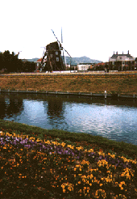

  

  
现在的大街上到处都开满了梅花，你那里怎么样呢？记得豪斯登堡那里的三色堇和油菜花漂亮极了。到了3月，就该轮到郁金香盛开了吧。  
对了，在公园的点心屋里，正好有对在吵架的情侣坐在我的身边，耳朵里不小心飘入了几句他们的谈话，不由地作了一番思考。  
这是一个关于如何表达温柔的问题。一件事（指吵架）发生之后，有些人会置之不理，有些人一定会忍不住说上几句。而对方的反应也会有截然相反的两种。有人会说“吵死了，闭嘴啊！”，有人会说“他对我不闻不问，好冷淡呐。”举我知道的一个例子，曾有对恋人向我解释他们分手的原因，女孩说：“我一直这么为他操心，可他……”而男的一方却说：“我总是尽力地为她着想，可她却……”其实双方都非常的温柔，可就是没法好好相处。而这种微妙的差错，不正是因为双方思维的一致，或者应该说是“投缘”所造成的吗？如果双方彼此间没有丝毫的共鸣，那我反而真的该对他们说：“你们在一起是没有将来的。”  
但是，喜欢一个人是不可预计的，我们需要花大量的时间去发掘、然后确认自己的感情，这时少男少女那种透着不安、焦躁的勇气，真的非常之可爱。在讨论别人问题时能客观地做出分析，但一遇到自己的事便立刻失去了方寸，这或许就是所谓爱情的特征。  
去豪斯登堡的这趟旅行，对我而言的确是一次卓有成效的休养。冈崎复活。之后一次深深吸引我的，是志摩町的西班牙村（译者注：位于志摩市磯部町，是一个类似于主题公园的度假村）。  
所以在这个夏天，准备要计划一份去伊势附近旅行的计划。（译者注：志摩市与伊势市同属三重县，珍珠很有名噢^\_^）  
P.S. 这次去的时候乘坐的是JAL航空，回来是ANA航空。嗯，对航空小姐有一点小看法。JAL给人的感觉是“我们从不会毫无理由地向客户微笑”。而ANA则给人以更亲切的朋友式微笑。女孩子的话应该会更喜欢ANA航空吧，不过怎么感觉想这种问题一般都是老头干的事呢。你的话，喜欢那家航空公司呢？  
2月某日（星期一） 与新上任的制作Y先生开了个小会。“今年想要做新的专辑呢”，绕着这个话题我们两人好好地谈论了一番，结果……成功了！为了实现这个目标，必须要提前做大量的准备工作，还必须要得到许多人的批准，但真想快点把这些问题解决掉，以最快的速度投入到歌曲创作中去。总之，现在的我就是好想好想唱歌，心里痒得让人受不了。然后，真心期待着大家听到这些歌的日子早日来临。  
2月某日（星期三） 啊，刚才吓了一大跳。给大家猜个QUIZ。在一张CD上再叠一张CD（即有两张CD重叠在一起），按下PLAY，会发生什么情况呢？答案是，会播放下面一张CD。刚才我亲身试过了。早上醒过来的时候，想要听一下，于是伸手把CD放了进去，按下PLAY，结果放出来的却是“95年动画片· WEDDING PEACH”的主题曲！昨晚写自己作曲曲目的时候，一边听这首歌一边在改正……啊啊，真的是吓了一跳呐。

---

今、梅の花があちこちで咲いています。あなたの場所ではどうですか？　ハウステンボスはパンジーと菜の花がきれいでした。３月は、もうチューリップ祭のはず。  
さて、園内のチョコレートハウスで、ちょっとケンカしているカップルと隣り合わせた私は、つい、耳が小ダンボになってしまい、ふと考えました。　　　　それは、やさしさの表現について。何かあった時に、放っておいて欲しい人と、必ず言葉をかけて欲しい人。これが逆に作用しあうと、「うるさいな」と「何か言ってくれたらいいのに冷たいなあ」になってしまうのですね。　　　　たとえば、悩む恋人どうしの言い分を聞いていて、女のコは、「こんなに彼のことを想っているのに。」と言うし、彼のほうも、「彼女のこと考えて努力してるのに。」と言う。  
どちらも、やさしいのにうまくいかない。　　　　この辺のセンスというか、表現のしかたの一致、それも「相性」というのではないかなと思いました。これがお互い全然違う所にあったら、それはもう、「組み合わせが違った」としか言えないのじゃないか。  
でも、「好き」なのはしかたなくて、人々はそれに気づいたり認めたりするのにすごく時間がかかるし、健気にもがいて、気持ちを揺らす。　とても可愛らしく悩む。  
それと、人からの相談には、客観的に考えられるけれど、自分の事になるとからっきしダメ、というのも恋の特徴かも。　　　　ハウステンボス行きは、良い意味でのリセットの旅になりました。　岡崎復活。  
そして次に私の心をとらえたのは、志摩スペイン村パルケエスパーニャ。夏を目標に、伊勢周辺の旅行計画をたてよう。  
Ｐ.Ｓ.　今回、行きはＪＡＬ、帰りはＡＮＡに乗りました。で、スチュワーデスについて。  
ＪＡＬは、「私達は、ムダに笑顔はふりまきません。」という心意気が見える。ＡＮＡはもう少しフレンドリーな笑顔で接してくれる。女のコのタイプとしてはＡＮＡの方が好きかな、などと、オヤジのようなことを考えていた私。あなたはどちらがお好き？  
２月○日（月）新しい担当ディレクターＹ氏と会議。「今年やりたいね」と思うことをあれこれ言い合っていたら・・・出た！　これを実現するには、下準備というか、何人かの人のお許しが必要だけれど、それがクリアになれば、明日からでもとりかかりたい気持ち。　今、私はとにかく歌いたくて歌いたくて、うずうずしている。そしてそれを聴いていただける瞬間を心待ちにしているんです。  
２月○日（水）あー、びっくりした。クイズです。ＣＤの上にもう１枚ＣＤを載せて（つまり２枚重ねて）、\[PLAY\]を押すと、どうなるでしょう？正解は、下のＣＤがかかる、です。今、やってしまった。目覚めに「A Happy Life」を聴こうと思って、手を伸ばしてポンと入れ、\[PLAY\]を押したら、鳴りだしたのは「‘９５年のアニメ・ウエディングピーチ」のオープニングテーマ！　昨夜、自分の提供曲のリストを書くのに聴き直してたんだった。　・・・あー、本当にびっくりした。