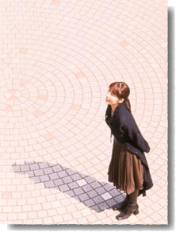

3月20日（土）、雨。　大阪サンケイホールにて井上喜久子さんのコンサート。 朝10:24発の新幹線に乗る。「とんぼ返り」とは、まさにこのことです、という見本のような一日でした。出番が終わって、弦楽器のみなさまと私は即、新大阪駅へ向かう。既にギリギリの時間だというのに、大渋滞だ…。　発車5分前、ようやく駅に到着。19:54発ののぞみで、ビュンと帰ってきました。 印象に残ったのは、行きの車窓から見てしまった大変な光景（火事！ １軒の家が燃えていた。）と、帰りの大渋滞の途中で見た行列のできていたお店（“まぐろナントカ”と書いてあった。　運転手さんによると、４フロアーもある安くておいしいおすし屋さんらしい。）でした。  
  
さて、たまに「ここは私の居場所ではないのでは？」という思いに駆られることが、あなたにはありますか？ 私はときどき。　突然、何かにあせる気持ちがふくらむのだけれど、現実には何も手につかず、どんどん考えにはまっていく感じ。そんな時の私の考えの着地は、次の２とおりです。 （１） これは、次のどこかへ行け、という心の声だ。（でも、心の声って…？！） （２） ただの考えすぎ。 今週は、ちょっとなつかしい人や、ものすごくなつかしい人（10年ぶり位）と会う約束があるので、それが楽しみで、きっと考えすぎる暇もなくなると思います。 27日（土）は、再び喜久子さんのコンサート。　今度は名古屋へビュンと行ってきます。　本当は新幹線のホームの“きしめん”をぜひ食べてみたいのですが、実現なるか？！ なんだか毎日、気温の差が激しいので、風邪ひかないで楽しく桜の季節を迎えましょうネ。  
  
3月20日（星期六）雨。井上喜久子小姐的演唱会在大阪サンケイホール礼堂举行。我是做早晨10：24分的新干线去的。但那天我几乎是到了那边，没做什么停留，便立即折返回来了。 演出场一结束，我便立刻和其他配乐的同事一起赶往新大阪站。 本来时间就安排的很紧了，结果还碰上了堵车……但总算是在发车前5分钟赶到了车站。坐着19：54分发车的盼望号（译者注：列车名字），呼地回来了。 印象特别深的是在行车过程中看到的场景（火灾！一间屋子在燃烧），还有在堵车时看到一家门口队伍排的很长的店（店面叫“まぐろナントカ”。听司机说，好像一共有4层楼，很便宜而且很好吃）。 说起来大家有时候会不会突然冒出这么一个念头，感觉“现在这个地方并不是我的归宿”？ 我有时候心情会突然变得很急躁，老是被某个想法牵着鼻子走，无法集中思绪。 这个时候我会依照以下两个办法，使自己冷静下来。 （1）只是我心灵的召唤，召唤我前往远方。（不过心灵的召唤也实在……） （2）只是我自己想多了。  
  
这周我和几个些许时日没见，还有几个许久未见（10年左右吧）的朋友约好了见面。真的很期待，估计也没有时间让我东想西想了吧。 27日（星期六），又是喜久子小姐的演唱会。这次是要去名古屋。很想吃吃看新干线车站卖的扁扁面（译者注：名古屋特产，没吃过），不过能够如愿吗。 总觉得每天的温差都很大呢。希望大家不要感冒，快乐地迎来樱花绽放的季节。
