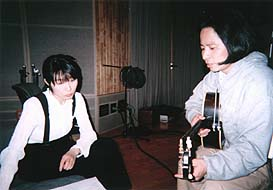
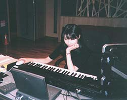
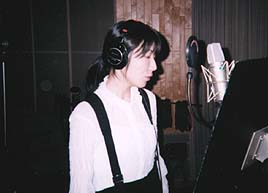

   
  
   
  
  
  
飯塚雅弓さんのレコーディングで。  
  
サウンドプロデューサーの長谷川さんと、コーラスを決めているところ。  
  
コーラスとなると、つい、はりきる私ですが、この日は少なめにあっさりにして、おとなしく帰りました。  
  
由于和饭冢雅弓的录音。  
  
可以断定合唱的声音制片人是长谷川先生。  
  
当变成合唱的时候、我是充满干劲的,这天不知不觉使感觉变成清淡,老老实实回家了。  
  
   
  
    
  
オズの魔法つかいの９曲が出来上がり、面倒くさい譜面も書き終えたので、外へ出た。  
  
最初にもらった台本と並べて、芝生の上に置いてみました。  
  
が、撮る前、２度、風が吹いてパニック！  
  
譜面は小ちゃな子供にも踏まれた。可愛い裸足だったので、まあ許す。  
  
因为オズの魔法つかい9首的歌曲完成了,并且也完书写了麻烦的乐谱，所以出去了。  
  
最初草稿是肩并肩整齐的放在夹子中的。  
  
但是，在拍摄之前,几次被风吹散了！  
  
并且乐谱也被对小孩踏了。因为是可爱赤脚地，所以饶恕了。  
  
    
  
セルフカバーアルバムのレコーディング２日め。  
  
まだ歌う日ではないので、合間にちょこちょこと遊んでいるところ。  
  
セルフカバー专辑的录音的2日。  
  
因为还没有到唱歌的日子、所以在工作的余暇做一些悠闲的事情。  
  
  
  
レコーディングの合間の日、ファンクラブの限定Photo Setの写真にメッセージ＆サインを書く。  
  
この日はまず１００枚。  
  
乾くまでと思って並べたら、壮観だったのでパチリ。  
  
失敗した１枚に、いたずらで三角の耳としっぽを描いて、ネコにした。スタッフの人に渡す時、これが届いた人は「当たり！」にしようか、と言って、大いにあきれられる。  
  
录音的余暇的日子里,为Fans俱乐部的限定Photo Set的照片写留言&签名。  
  
这天首先是100张。  
  
当准备写的之前,排列好了的时候,真是壮观的景象啊。  
  
失败了的1枚,由于恶作剧画了耳朵和三角形的尾巴,变成了猫。据说当时把这个在交给职员的人的时候，那个人说道"中彩了！"之类的话，感到非常惊讶。  
  
  
  
早く歌いたい気持ちでいっぱいだった私は、マイクの前に立って、じーん。  
  
ヘッドフォンで聴く研ぎ澄まされた音に、そう、この感じ！と思う。  
  
由于站着话筒之前，有种非常想快的唱歌的心情的我。  
  
在话筒的声音听着变得敏锐了，就是，这个的感觉！我这样想着。  
  
6月○日（火）  
  
今度の林原めぐみさんのアルバムで私が作詞曲をしている「Good　Luck!」のコーラスに行く。  
  
私は燃えた。  
  
既に録られていた林原さんのVo.と光宗さんのサウンドに、魂が入っていたから。  
  
終わって一息ついていると、ビックリ！　ご本人の登場。  
  
これから別の曲のレコーディングだそう。  
  
ちょっとおしゃべりしていて、レイちゃんと写ったのやらなにやらのプリクラを、「どれか好きなのあったら...」と、見せてくれた。  
  
私は選 べなくて、「全部、って言ったら怒る？」と聞いたら、笑って６枚を全種類切り取ってくれた。港区あたりで、ひとりで堂々と撮ったらしい。  
  
あいかわらず、可愛いくせにワハハ！な人だ。  
  
这次准备为林原めぐみ的下张专辑的音乐是我作词曲的"Good Luck!"的去参加合唱。  
  
我燃烧了。  
  
因为要同时为林原小姐的Vo.准备和还要给光亮先生的录音，决心进入了魂里。  
  
终了好好的歇了一口气，震惊！本人的出场。  
  
然后好象是为其他的曲的录音。  
  
稍微整理了一下外表之后，和Rey 照了一些大头贴，看见了“每个都是喜欢的。。。”。  
  
我没选“缩小”，说着「全部，不行吗？」的话，笑着剪下了全体种类 6 张。是港区附近，一个人堂堂地拍照的样子。  
  
照旧，可爱的哇哈哈！这样的人。
