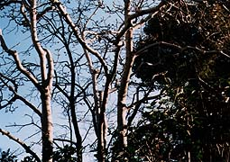

<strong>●カラフル＆ポップなMyユビワ</strong>  

  
**●丰富多彩&嘭嘭的My首饰**  

  
  

  
左端の赤いのは、HMVでのイベントの時、右端の花の形の赤は、"A Happy Life"のプロモーションビデオ撮影のときにもつけていたもの。  

  
ブルーのも木の葉の形のグリーンも、ぱっと見て、透明感があっていいなと思ったのでした。  

  
左端红色的,是在HMV的时候戴的，右端的红的花型的，也是在视频"A Happy Life"的专辑摄影的时候戴的。  

  
蓝色的东西和绿色的树叶型的也是，看着的时候，也许会认为有透明的感觉哦。  

  
**●東京２度目の雪の翌日**  

  
**●东京第2场雪的第二天**  

  
   

  
  

  
晴れわたった空を見上げると、白もくれんの枝先に可愛い小さな芽がいっぱい。  

  
こんなに寒くても、春は近し。  

  
当向上看晴空万里的天空的时候，覆着白色的树枝充满可爱小嫩芽。  

  
尽管这样冷，但是离春天也不远了。
