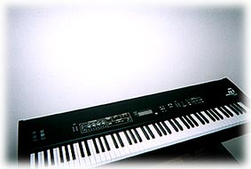

**キーボードがやって来た \['98.5.19\]**  

  
**●「夜の八重桜」**  

  
  

  
街灯に照らされて、ぷっくりと可愛らしかった八重桜。  

  
帰り道に撮りました。  

  
そういえば、虎屋には「夜の梅」という妖しげな名のようかんがあるが、いったいどんな由来があるんだか・・・。  

  
被路灯照亮的,是茯苓和可爱的八重樱花。  

  
在归途拍摄了。  

  
如果那样说的话、好象是作为在虎屋的"夜之梅"这个妖怪很有名,但是到底有什么样的由来呢？  

  
**●「Who are you?」**  

  
  

  
私は視力がとても良いので、その昔、メガネ姿に憧れて、ひとつ買ってしまった。  

  
それが、これです。  

  
レンズは、もちろん度なしのガラス。  

  
我因为视力很好，有一天，想看看自己戴眼镜姿态,所以买了一个。  

  
那个，就是这样子的。  

  
那眼镜，是没有度数的玻璃而已。  

  
**●「キーボードがやって来た」**  

  
**● "电子琴来临了****"**  

  
  

  
これは、コルグのN1という機種。  

  
音質もとても気に入っていますが、そのリアルさに笑い驚くのは、＜Gun Shot＞＜Applause＞＜Helicopter＞など。これらの音が出てくると、ヘッドフォンの中、私は突然、“ここはどこ？私は誰？！”になる。  

  
このキーボードでの第１作めは、小森まなみさんへの曲でした。秋ごろに聴いていただけるのかも。  

  
这个是コルグ的N1这个的机种。  

  
音质很让人中意，我非常惊喜。＜Gun Shot＞＜Applause＞＜Helicopter＞当这些音发出来的时候,在气氛中,我突然地，感到“这里是什么地方？我是谁？！”。  

  
第一次用这个键盘的是为小森まなみ的作曲子。大约在秋天的时候吧。
