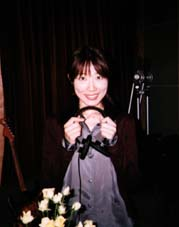
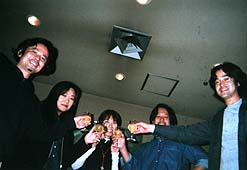

**レコーディングPhoto日記 \['98.10.13\]**  

  
  

  
毎日、違うお花が飾られていてうれしかったスタジオ  

  
この日は黄色のばらでした  

  
每天，这里有的不同装饰花让人感到高兴  

  
这天是黄色的蔷薇  

  
  

  
ハセガワさん、ピアノを弾く  

  
楽しそう  

  
ハセガワ先生，弹着钢琴  

  
很高兴的样子  

  
  

  
オカザキも、ピアノを弾く  

  
緊張してる  

  
OKAZAKI（自称），也弹着钢琴  

  
很紧张的样子  

  
  

  
レコーディング終了で乾杯！  

  
明け方の眠いからだに、  

  
つめたいシャンパン、しみこむ、しみこむ  

  
庆祝录音结束的干杯！  

  
终于可以好好休息了，  

  
淡淡的香槟，干吧，干吧
