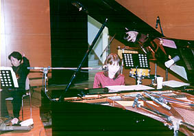
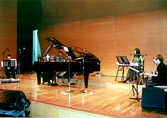
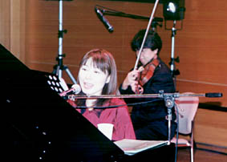

  
  
  
  
14:00　リハーサル開始  
  
ビオラの村山達哉さん、まだくつろいでる？！  
  
14:00 彩排开始  
  
拉着中提琴的村山达哉,显得很轻松的样子？  
  
  
  
   
  
強力なミュージシャン4人組に守られて  
  
紅一点はデビュー間近の大津美紀ちゃん  
  
http://www.asu-1.com/MUSIC/OHTSU/  
  
被实力很强的音乐4人组保卫着  
  
一点红是初次登台在近处的大津美纪小姐  
  
（网址貌似过期了）  
  
  
  
   
  
のってきた　のってきた  
  
何十分か後には一年ぶりにみなさまとご対面だ  
  
登场了 登场了 几十个分以后时隔1年之后和大家的第一次会面  
  
  
  
サービスショット!  みんなの人気者長谷川智樹さん  开场镜头！ 是人气很高的長谷川智樹先生  
  
  
  
いよいよ本番　心臓の鼓動はトットットッ… 终于正式登场了，心脏嘣~嘣~嘣~跳着…  
  
  
  
プレゼントのヨックモックのクリスマス缶  
  
私も大好き  
  
大家给的圣诞礼物  
  
我非常喜欢  
  
 後半はもうあっというまでした 何曲か抜かしちゃった？と思ったくらい 后半场一转眼就到了 我在想该弹什么曲子好呢？  
  
   
  
  
  
「月下の散歩」で使った楽器はロイヤルハープ  
  
…街を歩いていて出逢ったそうです 「月下の散歩」使用的乐器是皇家竖琴 …好象是在市镇散步的时候遇到的
