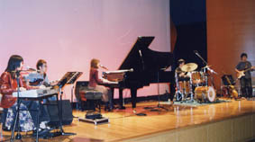
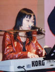
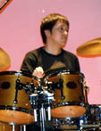
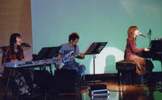
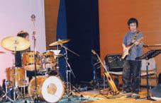
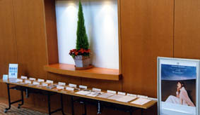

  

  
**ファンクラブ“Ritzberry Fields”でのプライベートコンサート**  

  
   

  
**これはまだリラックスムードのリハーサル風景**  

  
  

  
今回のセッティングはこんなかんじ  
此次安排的感觉是这样  

  
  

  
才能のキーボード＆ sweet voice 大津美紀さん  
充满才华的键盘手&sweet voice大津美纪小姐  

  
  

  
スタイリッシュな彼はカメラまでおしゃれ　クールなベーシスト内田哲也さん  
打扮时髦感觉很酷的BASS 内田哲也先生  

  
  

  
私 この日はピアノで歌いました  
我 这天是钢琴手和唱歌的  

  
  

  
   

  
切れ長の目が美しいけれどおちゃめ度200％がときどき全開 ドラムス小島徹也さん  
有着细长美丽的眼睛 但表情有趣度200% 的鼓手 小岛彻也先生  

  
  

  
頼もしいProducerで華麗なギタープレイヤー そして私のlovelyなマスコット（?!）長谷川智樹さん  
可靠Producer 华丽的吉他手以及我的 lovely 吉祥物（?!）長谷川智樹先生  

  
  

  
歌ってみる よしよしイイ感じ  
唱歌准备  
摇摇依依的感觉  
ドラムはJazz用のひと回り小さいサイズ  
大鼓是Jazz使用的人一周的大小  

  
  

  
ハセガワさんのギターは20年来くらいの年代ものだそう  
長谷川先生的吉他 大约20年来一直在使用的吧  

  
  

  
開演前 まだみなさまのお越しを待つ静かなロビー  
开演前  
大家在这个的寂静大厅等待  

  
これは2001年の私の大切な仕事一覧  
这些就是我2001年的一些工作情况  

  
そして本番は・・・次号で！
