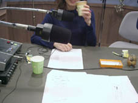

  
  
７月１日（月）…ニューシングル「愛しいかけら」のＣＭスポットのナレーションを録っているところ  
  
７月１日（周一）…正忙着给新单曲<愛しいかけら>的广告作解说词的录音工作  
  
  
  
７月１５日（月） …インストアイベントの日にお持 ち帰りいただく色紙にサインをし  
  
ていますときどきマジックの匂いがクハッ  
  
と鼻を直撃して頭がくらっ…  
  
正在为首发日的附赠品中 的彩色纸作签名 常常魔术般的香味 直接传到鼻子里…  
  
撮影：日向めぐみ（←デジカメの巨匠）
