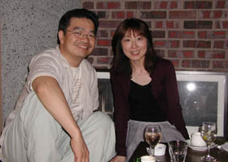
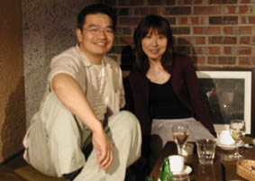

  

  
2001年７月11日（水）  

  
都内某所にて  

  
フルーツバスケットの大地丙太郎監督と対談  

  
2001年７月11日（水）  

  
在东京都内某处  

  
与水果篮子的大地丙太郎监督的谈话  

  
はじめは緊張して、撮影でも“それじゃあガチガチのお見合い写真みたい！”と笑われていた私  

  
対談も終わり、みなさんでの会話も弾みに弾んで…  

  
時おりいい風が入る中、“仕事なのにこんなに楽しい気分でいいのでしょうか…”というところをパチリ  

  
なごんでおります  

  
开始感到紧张,甚至那照片“看着那么像僵硬的相亲照片！”我还被这样嘲笑了  

  
对话也结束了,大家都谈的很尽兴…  

  
有时这样有感觉，“工作的时候有这样愉快的心情就好了…”正好这个的时候“咔嚓”的被照下来了  

  
  
そしてこちらは“フラッシュなしの方がいい感じに撮れるん です”との監督の言葉に従って  
以及这个是“在闪光方向对好的方向拍下的”  
监督是这么说的
