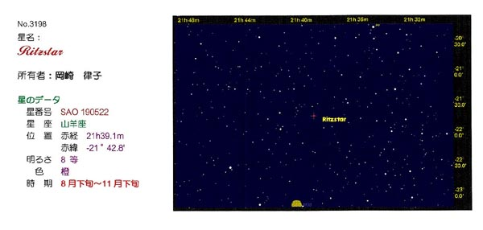
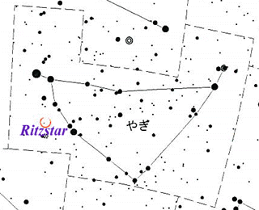

  

+ No. 3198
+ 星名: Ritzstar
+ 所有者: 岡崎律子
+ 星のデータ星番号:SAO 190522
+ 星座: 山羊座位置: 赤経 21h39.1m 赤緯 -21°42.8'
+ 明るさ: 8等色: 橙
+ 時期: 8月下旬～11月下旬

---

  

---

山羊座の一角に、一見何の変哲もないオレンジ色の星が輝いています。名前は"Ritzstar"。
1997年の冬、岡崎律子さんの誕生日を記念してわたしたち
Ritzmail がプレゼントした星です。決してきらびやかな星ではありません。空の澄みきった夜、磨きぬいたレンズを通して、ようやく見ることのできる星。でもわたしたちにとって、たったひとつのたいせつな星。この星に、わたしたちはひとつの願いを託しました。

この星のように　岡崎さんが　いつまでも輝き続けますように……

"Ritzstar" は、北海道·しょさんべつ天文台の My Stars system により登録されています。

---

在摩羯座一角上，乍一看没有什么出奇之处的橘子颜色的星星也闪耀着光辉。它的名字是"Ritzstar" 。
1997年的冬天，岡崎律子小姐的生日那天，Ritzmail送出的礼物就是这颗星星。虽然不是光辉灿烂的星星。天空清澈了的夜晚，通过擦干净了的透镜，能看见的星星。
但是对我们来说，是一个重要的星星。在这个星上，我们托付了一个愿望：

“希望像这个星星一样岡崎律子小姐的光辉也永远地持续闪耀着……”

"Ritzstar" 北海道·しょさんべつ天文台的 My Stars system 登记。