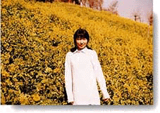

**－1997年、春－**

深呼吸して、気を落ちつけて、Go。 深呼吸，冷静下来，Go。

砂に足をとられて手をつなぐ恋人たち。 脚踩着砂牵着手的恋人们。

 

ひとりでいても楽しいのは、寂しくない時。 一个人在也有快乐的、不寂寞的时候。

 

'97年3月10日、六本木のスタジオにて。

これは試し撮りのポラ。

'97年3月10日，六本木的艺术家工作室。

这个是尝试拍摄的pose。
