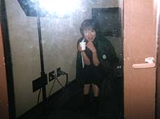

すわ、お盆の怪奇現象か？！

・・・違う。ブースの中で、冷房に凍えて背を丸くする岡崎。

哇,这个是的怪异的现象吗？！

・・・不是。在录音室中、被冷气设备冻僵了弓着背的岡崎。

次のアルバムの新曲「Rain or Shine」でのノッた演奏を、じっくり聴き直す大ミュージシャン様たち。

大きい音がダメな私は、半分、耳をふさいで音量調節をする。

正在试听下张专辑的新曲《Rain or Shine》的演奏、并且修正的音乐工作者们。

音量太大，我不行了，所以堵住了一半耳朵，做音量调制。

ミュージシャンの演奏と、せーの、で一緒に歌うのは楽しい。

ただし、ブース（部屋）は私だけ別。カウントやかけ声は、ヘッドフォンだけでつうじている仲です。

在音乐工作者的演奏、一起唱歌的事是非常快乐的。

但是,小房间(录音室)里的我就不同了。记录声音，是只有透过耳机的交情。

聴き直したプレイはバッチリで、プロデューサーの長谷川さん、満足そうににっこり。

听着修改完成的音乐，制作人长谷川先生，笑嘻嘻的感到满意的样子。

今回の現像の初めのほうに入ってました。

＜アニメＶ＞の取材の日に、キングレコードのＴ嬢が「Ritzberry Fields」のサンプルＣＤを持ってきてくれて、喜んでいるところ。

这次向开始的方向是进入。

＜动画片V＞的取材的日子，KING RECORD 的T小姐在の拿来《Ritzberry Fields》的货样ＣＤ正感到高兴。
