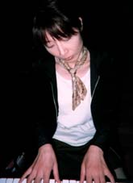

**レコーディングPhoto日記 \['98.10.13\]**

毎日、違うお花が飾られていてうれしかったスタジオ

この日は黄色のばらでした

每天，这里有的不同装饰花让人感到高兴

这天是黄色的蔷薇

ハセガワさん、ピアノを弾く

楽しそう

ハセガワ先生，弹着钢琴

很高兴的样子

オカザキも、ピアノを弾く

緊張してる

OKAZAKI（自称），也弹着钢琴

很紧张的样子

レコーディング終了で乾杯！

明け方の眠いからだに、

つめたいシャンパン、しみこむ、しみこむ

庆祝录音结束的干杯！

终于可以好好休息了，

淡淡的香槟，干吧，干吧
