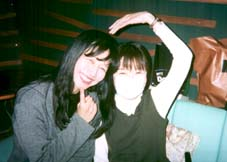

**●「１月末の小さな旅行」**

平日なのですいているとはおもったが

着く頃にはとうとう貸し切り状態

飛行機のはずがこんな地味な電車に・・・

这是平常少有的,

最后准备好到达的时候

发现不是飞机，而是这样的宁静的电气列车

菜の花の黄色はいかにも“春”

ここではもうすぐ桜が咲いちゃうそうだ

油菜花的黄色真的是"春天"啊~

好象这里也马上要开满樱花了

帰ってから庭に植えようと思い

水仙をおみやげにした

甘いいい匂いがしていました

准备回家之后在院子里栽种的,

旅行纪念品----水仙

据说正是有花香的时节

**●「喜久子さんと私」**

**'98年12月末の喜久子さんと私**

この日　喜久子さんは高性能の

携帯電話に変えたとかで

とてもうれしそう

98年12月末的喜久子小姐和我

那天 喜久子小姐换了一个

高性能的移动电话

好像很高兴的样子

**●「みんなのんびり顔」**

'98年12月末

年内最後のスタジオの日

ゆったりと弦楽器の録音を

終えてパチリ

98年12月末

年内最后一次录音室的日子

管弦乐的录音工作

终于结束了
