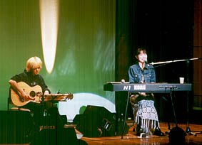

開演前のリハーサル

歌ってみつつ私も客席で聴いてみて確認

开演前面的彩排

一边听自己唱歌，一边也在确认客席

寒がりだから「春」が好き

因为怕冷所以喜欢"春天"

派手な金髪ガッチャンのギターで

静かな「星空にお祈り」

有着花哨金发的吉他手

弹着寂静的「星空にお祈り」

「Bon voyage!」を歌うと

もはや自然に足がステージから

降りて歩いてしまう…？！

唱着「Bon voyage!」

脚已经自然而然的

从舞台走下来…？！

けやきホールでのおつとめを終えて

私と一緒に帰宅

何事もなかったかのように部屋に鎮座するピアノ

结束了今天的演出

和我一起回家的

是没有任何事情的在房间坐镇的钢琴
