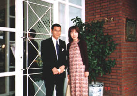
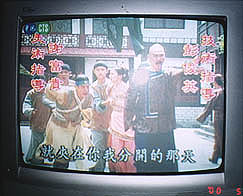

5月23日（火）成田にて

平日でも空港は旅行者でいっぱい 5月23日（火）成田 平时机场也充满了旅游者

泊まったホテル

サーモンピンクの色調がかわいらしい部屋でした

スタッフもメイドさんもみーんなにこにこフレンドリーな台湾の人たち 曾住过的大饭店

粉红色的色调可爱的房间的

酒店的台湾职员和佣人都的笑嘻嘻很亲切的等候着。

2日目の朝

迎えに来てくれた現地ガイドの翁章さん

私はまだちょっと…眠い 第2天早晨 迎接了的当地向导的翁章先生 不过我…有点困

忠烈祠

ここは１時間ごとの衛兵の交代式で有名な場所

周りは地元台湾の人たちが多かったのでやっぱり“観光地”なのでしょう 忠烈祠 这里是每隔1小时而进行的卫兵的轮换的出名的地方

因为周围的台湾的人们多了所以成了当地的"旅游地"吧。

そしてこの人が１時間微動だにしない衛兵さん

隣に立ってギャグを言ったとしても決して笑わないはず

気温は32～33℃とみた

エライ!! 以及整整1小时丝毫不动的这个人卫兵

站立于说很喜剧的事情也绝对不可能笑的

当时气温32～33℃ 真厉害!!

故宮博物院

ここは１日中じっくり時間をとってもよかったかも

そして、夕方、展望台から台北全体を見て満足

おみやげ屋さんは東京タワーのそれと似てる

故宮博物院 这里也许逛了一整天的时间

以及，傍晚，在了望台满意的观看了台北全貌 那个纪念品和图案像似东京塔的门票

夜は部屋でＴＶをチェック

わかりやすいいかにもの時代劇といったところ?!

全然わからないのだけれどちょっとギャグの匂いもして面白そう 晚上在房间里面看电视节目 大家一起看非常浅显易懂的历史剧？！ 虽然我完全听不懂，可是好象很有趣的样子。。
