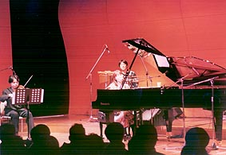
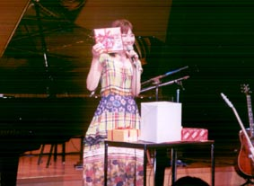
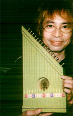

14:00　リハーサル開始

ビオラの村山達哉さん、まだくつろいでる？！

14:00 彩排开始

拉着中提琴的村山达哉,显得很轻松的样子？

 

強力なミュージシャン4人組に守られて

紅一点はデビュー間近の大津美紀ちゃん

http://www.asu-1.com/MUSIC/OHTSU/

被实力很强的音乐4人组保卫着

一点红是初次登台在近处的大津美纪小姐

（网址貌似过期了）

 

のってきた　のってきた

何十分か後には一年ぶりにみなさまとご対面だ

登场了 登场了 几十个分以后时隔1年之后和大家的第一次会面

サービスショット! みんなの人気者長谷川智樹さん 开场镜头！ 是人气很高的長谷川智樹先生

いよいよ本番　心臓の鼓動はトットットッ… 终于正式登场了，心脏嘣~嘣~嘣~跳着…

プレゼントのヨックモックのクリスマス缶

私も大好き

大家给的圣诞礼物

我非常喜欢

 後半はもうあっというまでした 何曲か抜かしちゃった？と思ったくらい 后半场一转眼就到了 我在想该弹什么曲子好呢？

 

「月下の散歩」で使った楽器はロイヤルハープ

…街を歩いていて出逢ったそうです 「月下の散歩」使用的乐器是皇家竖琴 …好象是在市镇散步的时候遇到的
