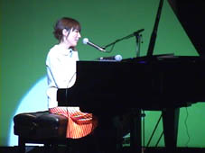
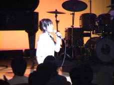

 

  

コンサートは「小さな祈り」でスタート

ところで、このワンピースについて

後日、“ひょう柄ですか？”との濡れ衣（?!）があって

私は小さなショックを受けた

実際はlovelyな小花プリントよ

音乐会由《小さな祈り》开始

我穿的是这件连衣裙

这天以后 这件衣服“很花哨？”是吗（?!）

我受到了小小的打击

实际是lovely的小花图案

ぐっと静かに「流星群の日」～「約束」

この後、「リグレット」～「A merry December」

でパワー全開！

静静的《流星群の日》～《約束》

然后是、《リグレット》～《A merry December》

马力全开！

「セレナーデ」弾き語りを終えて

今年も一年アリガトウゴザイマシタ

结束了《セレナーデ》弹唱

今年也“谢谢大家了！”

そして最後はやっぱり…

ウキウキとステージを降りてしまう私

「春だもの！」を歌いながら

以及最后这张是…

一边缓缓走下舞台的我

一边唱着《春だもの！」》

 

Ritsuko Okazaki Private Concert Vol.5

☆　小さな祈り

☆　BLUE POINT

☆　夏の空港

☆　はじまりはここから

☆　Christmas Day is coming

☆　流星群の日

☆　約　　束

☆　リグレット

☆　A merry December

☆　For フルーツバスケット

☆　セレナーデ

☆　春だもの！
