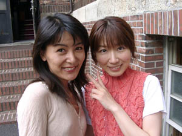

 

 

６月○日(金)･･･その日、私は総勢約46名のオーケストラを率いて歌うという、内心、ド緊張のスタジオに向かっていた。(現在、私はレコーディング中です。）

スタジオへの坂を上っていくと、あれっ？ 向こうから歩いてくるトリオは…

“え？”　“えっ？！”　“エーッ！！”

6月10日(金)･･･这天，我带领总共约46名成员的管弦乐队，心里非常紧张的前往录音室。（现在，我正在录音室中）

正在上那个スタジオへ(地名)的坡的时候，看见了一起散步的三人组

“恩？”“恩？！”“啊！！”

『フルーツバスケット』以来、まったくの偶然だった不思議な４ショット。

左から、フルーツバスケットのあの印象的なＯＰ映像や「セレナーデ」の流れた回などを作った長濱さん、ひそかな人気者だった“はなちゃん”の声の麗子さん、そして、いわずと知れた監督の大地さんです。あー、びっくり。ウレシイびっくりだ。

『フルーツバスケット』以后，完全的偶然地相遇的4人的不可思议的镜头

左边是《フルーツバスケット》的那个让人印象深刻的OP动画和「セレナーデ」的过场演出的制作人長濱先生、以及为"小花"（花岛 咲）的配音的麗子小姐，还有，即使不说大家都认识的大地监督先生。啊，感到吃惊。非常吃惊啊~

会ったのはこれでまだ３度目だけれど、つい告白。“最後のほうでは私もすっかりはなちゃんファンでした”

虽然是第3次见面了的，可是还不知不觉坦白了这个的事。

“最后还是的说出了我也是小花（花岛 咲）的fan”
